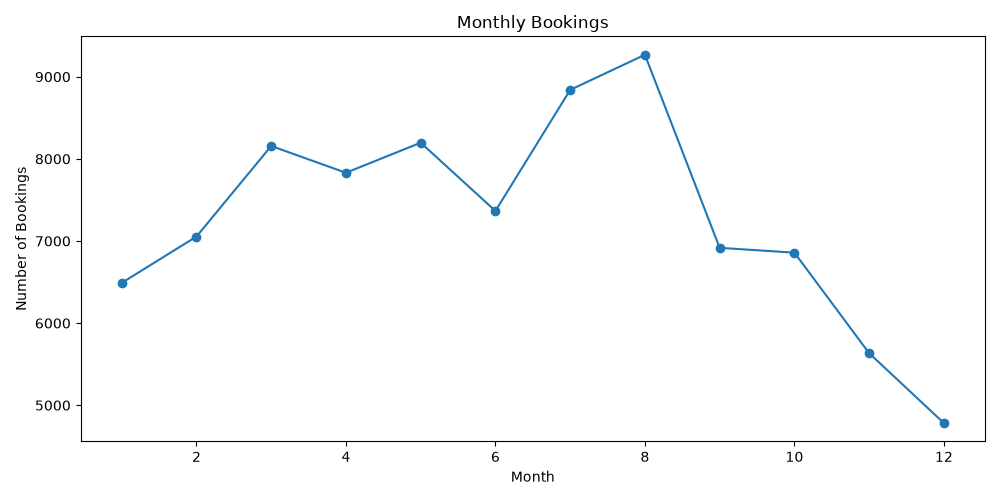
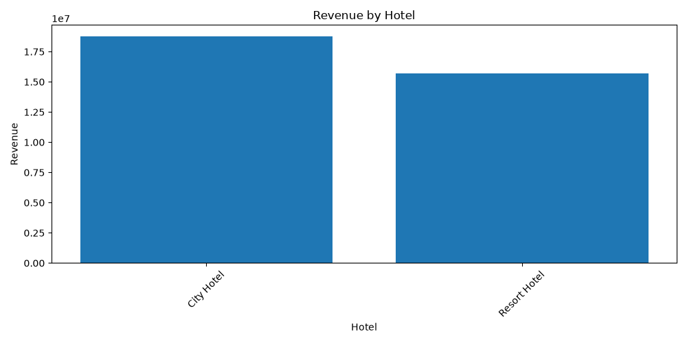
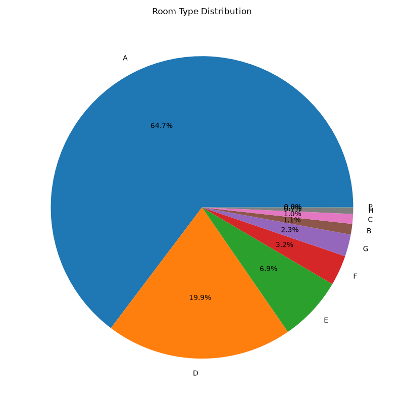
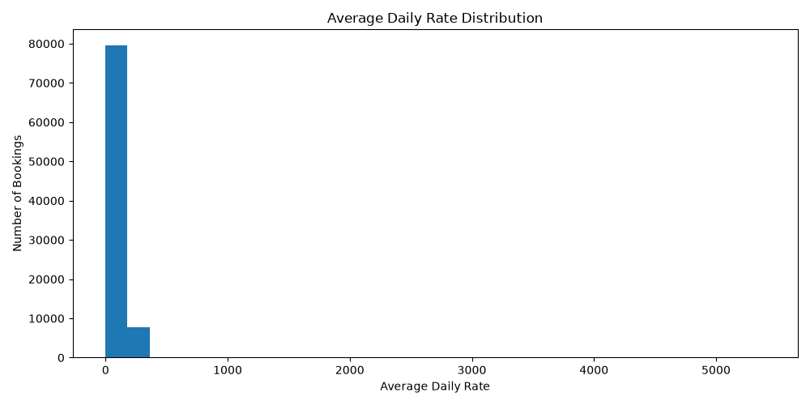
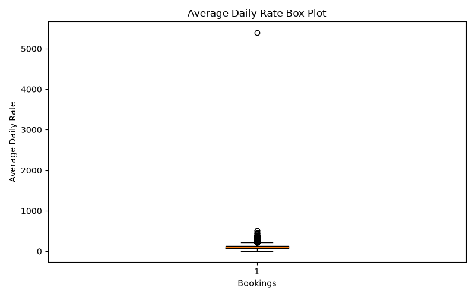
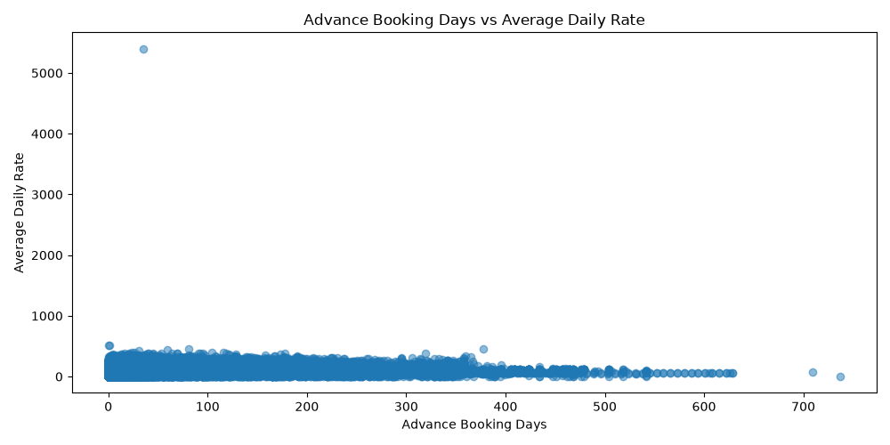
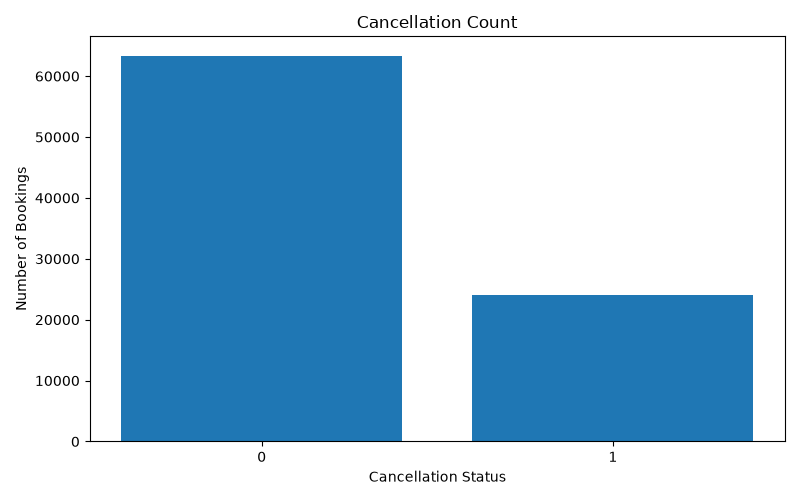

# 🏨 Hotel Booking Pricing & Occupancy Analytics


---

## 📌 Project Overview

This project presents an end-to-end Data Analytics workflow for analyzing hotel booking data. The objective is to extract meaningful business insights related to booking trends, pricing, occupancy, cancellations, customer behavior, and hotel performance.

The project follows a complete analytics pipeline starting from raw data, performing cleaning and feature engineering, conducting exploratory data analysis (EDA), generating visualizations, and preparing the cleaned dataset for Power BI dashboard development.

---

# 🎯 Objectives

- Load and inspect hotel booking data
- Clean and preprocess the dataset
- Perform Feature Engineering
- Conduct Exploratory Data Analysis (EDA)
- Generate business-focused visualizations
- Identify pricing and occupancy trends
- Analyze cancellation behavior
- Prepare clean data for Power BI
- Write SQL queries for analytical reporting

---

# 🛠️ Technologies Used

| Tool | Purpose |
|-------|----------|
| Python | Data Analysis |
| Pandas | Data Cleaning & Manipulation |
| NumPy | Numerical Operations |
| Matplotlib | Data Visualization |
| Streamlit | Interactive Web Dashboard |
| Plotly | Interactive Charts & Graphs |
| openpyxl | XLSX (Excel) File Support |
| xlrd | XLS (Legacy Excel) File Support |
| SQL | Business Query Analysis |
| Power BI | Dashboard Preparation |
| Jupyter Notebook | Interactive Analysis |

---

# 📂 Project Structure

```text
Hotel Booking Analytics/

├── app.py                        ← Streamlit Dashboard (supports CSV, XLSX, XLS, TSV)
│
├── data/
│   ├── raw/
│   │   └── hotel_bookings.csv
│   │
│   └── processed/
│       └── cleaned_hotel_bookings.csv
│
├── notebooks/
│   └── Hotel_Booking_Analysis.ipynb
│
├── src/
│   ├── main.py
│   ├── data_cleaning.py
│   ├── feature_engineering.py
│   ├── eda.py
│   ├── visualization.py
│   └── utils.py
│
├── sql/
│   └── analysis_queries.sql
│
├── dashboard/
│   └── power_bi_dashboard_plan.md
│
├── images/
│
├── reports/
│
├── README.md
├── requirements.txt
└── .gitignore
```

---

# ⚙️ Project Workflow

```text
Raw Dataset
      │
      ▼
Data Inspection
      │
      ▼
Data Cleaning
      │
      ▼
Feature Engineering
      │
      ▼
Exploratory Data Analysis
      │
      ▼
Data Visualization
      │
      ▼
Business Insights
      │
      ▼
Prepared Dataset
      │
      ▼
Power BI Dashboard
```

---

# 📊 Exploratory Data Analysis

The project analyzes several important business questions including:

- Monthly Booking Trends
- Revenue Analysis
- Average Daily Rate (ADR)
- Room Type Distribution
- Cancellation Analysis
- Hotel Performance
- Booking Lead Time
- Pricing Trends

---

# 📈 Generated Visualizations

## Monthly Booking Trends



---

## Revenue by Hotel



---

## Room Type Distribution



---

## Average Daily Rate Distribution



---

## Average Daily Rate Box Plot



---

## Advance Booking vs Price



---

## Cancellation Count



---

# 📌 Key Performance Indicators (KPIs)

This project focuses on measuring the following business KPIs:

- 📅 Total Bookings
- 💰 Total Revenue
- 🏨 Revenue by Hotel
- 📈 Monthly Booking Trend
- 💵 Average Daily Rate (ADR)
- ❌ Cancellation Count
- 🛏️ Room Type Distribution
- 📆 Advance Booking Behaviour

---

# ❓ Business Questions Answered

- Which months receive the highest number of bookings?
- Which hotel generates the highest revenue?
- Which room type is booked most frequently?
- How are booking prices distributed?
- Does booking earlier affect room price?
- What is the overall cancellation trend?
- Which hotel performs better in terms of revenue?

---

# 🧹 Data Cleaning

The dataset is cleaned automatically using Python.

Cleaning steps include:

- Removing duplicate records
- Handling missing values
- Standardizing text values
- Converting date columns
- Correcting numeric data types
- Removing inconsistent values where applicable

The original dataset is never modified.

The cleaned dataset is saved in:

```text
data/processed/cleaned_hotel_bookings.csv
```

---

# ⚡ Feature Engineering

Additional analytical features are created whenever possible, including:

- Stay Length
- Booking Month
- Booking Year
- Booking Weekday
- Weekend Booking Indicator
- Revenue
- Advance Booking Days
- Revenue Lost (where applicable)

---

# 🗄️ SQL Analysis

The project also contains beginner-friendly SQL queries for:

- Revenue Analysis
- Monthly Bookings
- Revenue by Hotel
- Top Performing Hotels
- Cancellation Analysis
- Average Room Price
- Occupancy Analysis

SQL file:

```text
sql/analysis_queries.sql
```

---

# 📊 Power BI

The cleaned dataset is prepared for creating an interactive Power BI dashboard.

The project includes a dashboard planning document:

```text
dashboard/power_bi_dashboard_plan.md
```

Recommended dashboard pages:

- Executive Dashboard
- Revenue Dashboard
- Occupancy Dashboard

---

# 🚀 How to Run the Project

## 1️⃣ Install Dependencies

```bash
pip install -r requirements.txt
```

---

## 2️⃣ Run the Streamlit Dashboard (Recommended)

```bash
streamlit run app.py
```

Open the URL shown in the terminal (usually http://localhost:8501), upload your file, and explore!

**Supported file formats:**

| Format | Extension | Notes |
|--------|-----------|-------|
| CSV | `.csv` | Standard comma-separated values |
| Excel (Modern) | `.xlsx` | Microsoft Excel 2007+ |
| Excel (Legacy) | `.xls` | Microsoft Excel 97-2003 |
| TSV | `.tsv` | Tab-separated values |
| Google Sheets | `.csv` / `.xlsx` | Export via File → Download, then upload |

> 📱 **Mobile friendly** — works on phone browsers too!

---

## 3️⃣ Run Using Python (CLI)

```bash
python src/main.py
```

---

## 4️⃣ Run Using Jupyter Notebook

```bash
jupyter notebook notebooks/Hotel_Booking_Analysis.ipynb
```

or open the notebook directly in VS Code and click **Run All**.

---

# 📁 Dataset

Place the original dataset inside:

```text
data/raw/
```

The cleaned dataset will automatically be generated inside:

```text
data/processed/
```

---

# 🔮 Future Improvements

- Interactive Power BI Dashboard
- Revenue Forecasting
- Customer Segmentation
- Dynamic Pricing Analysis
- Booking Prediction using Machine Learning
- Geographic Booking Analysis

---

# 👨‍💻 Author

**Durgesh Kushwaha**

B.Tech – Artificial Intelligence & Data Science

Data Analytics | Python | SQL | Power BI

---

## ⭐ If you found this project useful, consider giving it a Star.
# hotel-booking-analytics
